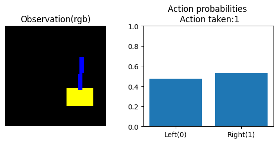
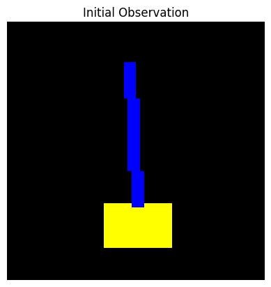
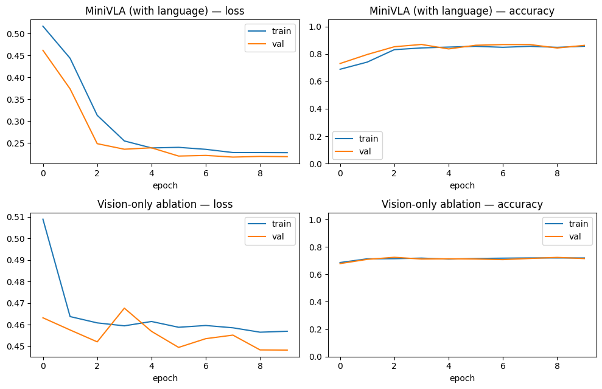
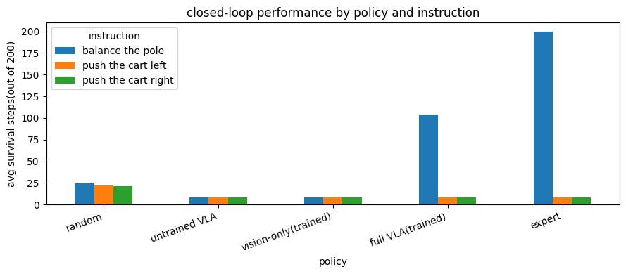
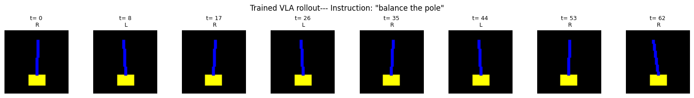
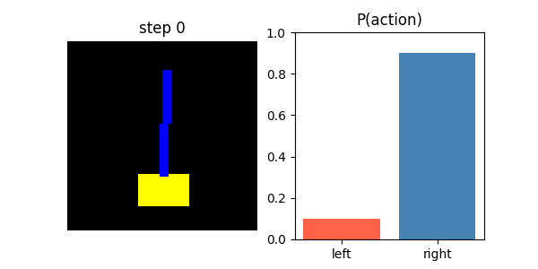
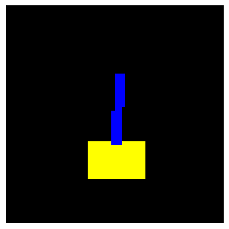

# Vision-Language-Action (VLA) Mini Simulator

I built this as a from-scratch learning project — a tiny Vision-Language-Action (VLA) pipeline that makes every tensor, transformation, and design choice inspectable. There are two notebooks: [`vla-scratch.ipynb`](/vla-scratch.ipynb) (starting point, no training) and [`vla-practical-demo.ipynb`](/vla-practical-demo.ipynb) (full trained VLA with imitation learning, ablation studies, and a GIF rollout).


The purpose is not to reproduce a production robotics VLA — it is to make the complete **vision → language → fusion → action** path small enough that I can inspect every step.

> Learning project: simulation only. No physical robot or hardware interface is required.

---

## 1. What This Project Is

A Vision-Language-Action model receives:

```text
Image / visual observation
        +
Human language instruction
        ↓
Vision encoder + language encoder
        ↓
Fusion
        ↓
Action / policy head
        ↓
Action probabilities
        ↓
Environment
```

In this miniature implementation, the input and output are deliberately tiny:

```text
Vision input:      64 × 64 × 3 RGB image
Language input:    text instruction
Actions:           0 = move left
                   1 = move right
Output:            P(left), P(right)
```

I keep the environment visual — the agent sees the scene as an image, not the raw simulator state.

---

## 2. The Two Notebooks

### 2.1 `vla-scratch.ipynb` — Starting Point (Simple, No Training)

I built the bare pipeline here first: custom environment, a small CNN vision encoder, a bag-of-words language encoder, concatenation fusion, and a policy head — all connected, but **with randomly initialized weights and no training loop**. The purpose is to verify the full control loop works before adding any learning.

**What I show in this notebook:**

- The `MiniCartPoleVisionEnv` environment outputs a 64×64 RGB image observation
- I render the observation with matplotlib to visually confirm the yellow cart and blue pole render correctly
- I manually step through actions 0 (left) and 1 (right) to verify the environment changes
- I confirm `observation_space.shape = (64, 64, 3)` and `action_space.n = 2`
- I build `MiniVLA` and run a 5-step inference loop — the network outputs action probabilities and the loop prints step, action, and reward
- I visualize the model's decision side-by-side: left panel = current RGB observation, right panel = action probabilities bar chart

**Sample output from the untrained inference loop:**

```text
step=0, action=1, reward=-0.099
step=1, action=1, reward=-0.070
step=2, action=1, reward=-0.091
step=3, action=1, reward=-0.091
step=4, action=1, reward=-0.104
```

The network outputs arbitrary probabilities because weights are random and there is no training.

**Observation + action probability visualization from `vla-scratch.ipynb`:**



### 2.2 `vla-practical-demo.ipynb` — Full Trained VLA with Imitation Learning

I upgraded the project here with real-physics dynamics, behaviour cloning training, an ablation study, quantitative evaluation, and a GIF rollout. This notebook runs on a CUDA device (T4 GPU in Colab).

---

## 3. Environment — `MiniCartPoleVisionEnv`

### 3.1 `vla-scratch.ipynb` version (simple dynamics)

I used extremely simple physics as a starting point:

```text
if action == 1:   x ← x + 0.05
else:             x ← x - 0.05

theta ← theta + Normal(0, 0.02)

reward = -|theta|
terminated when |theta| > 0.5
truncated = False
```

The pole angle is updated with Gaussian random noise — the action moves the cart but does not directly control the pole angle. This is intentional for the starting-point demo.

### 3.2 `vla-practical-demo.ipynb` version (real CartPole physics)

I upgraded to the actual coupled cart-pole equations (Barto, Sutton & Anderson, 1983):

$$\text{temp} = \frac{F + m_p \ell \dot\theta^2 \sin\theta}{m_c+m_p}
\qquad\qquad
\ddot\theta = \frac{g\sin\theta - \cos\theta \cdot \text{temp}}{\ell\left(\tfrac{4}{3} - \tfrac{m_p \cos^2\theta}{m_c+m_p}\right)}$$

Now the force applied to the cart genuinely changes how the pole rotates — the environment is actually *controllable*, which is a prerequisite for anything to be learnable from it.

Episode termination: `|x| > 2.4` or `|θ| > 12°`. Reward: `+1` per step survived (classic CartPole convention). `max_steps = 200`.

**Initial observation rendered from the environment:**



Both versions expose:

```text
observation_space = Box(0, 255, shape=(64, 64, 3), dtype=uint8)
action_space      = Discrete(2)
```

The renderer creates a 64×64 RGB image with Pillow:

```text
black background
      |
      +-- yellow rectangle = cart
      |
      +-- blue line        = pole
```

---

## 4. Components

### 4.1 Vision Encoder

I built a small convolutional neural network:

```text
Input:  64 × 64 × 3
   ↓
Conv2D: 3  → 16 channels, kernel 3, stride 2, padding 1
   ↓
ReLU
   ↓
Conv2D: 16 → 32 channels, kernel 3, stride 2, padding 1
   ↓
ReLU
   ↓
Flatten
   ↓
8192-dimensional vision vector
```

Spatial dimensions change as follows:

```text
64 × 64 × 3
       ↓ first stride-2 convolution
32 × 32 × 16
       ↓ second stride-2 convolution
16 × 16 × 32
       ↓ flatten
32 × 16 × 16 = 8192
```

In the `vla-practical-demo.ipynb`, I added `BatchNorm2d` after each conv layer to stabilize and speed up training. I verified: `vision_encoder(to_tensor_batch(obs)).shape == torch.Size([1, 8192])`.

### 4.2 Language Encoder

The language side is deliberately primitive — I use a bag-of-words hashing scheme instead of maintaining an explicit vocabulary.

**In `vla-scratch.ipynb`:** I use Python's built-in `hash()`:

```python
bow = zeros(1000)
for word in text.lower().split():
    index = abs(hash(word)) % 1000
    bow[index] += 1
```

**In `vla-practical-demo.ipynb`:** I switched to `hashlib.md5` because Python's `hash()` is randomized per interpreter process (`PYTHONHASHSEED`), which broke saved checkpoints since the same instruction hashed to different buckets every time the kernel restarted. `hashlib` gives the same bucket for the same word, every time, on every machine:

```python
def stable_hash(word, size):
    digest = hashlib.md5(word.encode("utf-8")).hexdigest()
    return int(digest, 16) % size
```

For `"keep the pole upright"` the nonzero buckets are `[347, 479, 811, 828]`.

The 1,000-dimensional hashed vector is then projected into a 32-dimensional embedding:

```text
1000-D hashed text vector
          ↓
     Linear(1000, 32)
          ↓
      32-D embedding
```

### 4.3 Multimodal Fusion

I concatenate the two embeddings:

```text
Vision:   8192 values
Language:   32 values
              ↓
          concatenate
              ↓
         8224 values
```

Formally: `z = [v ; t]`

In the `vla-practical-demo.ipynb` version, I added a `use_language` flag. Setting it to `False` removes the language branch entirely, giving a **vision-only ablation model** with the exact same vision encoder and training procedure. I train both and compare them to test whether language actually *matters*, rather than just assuming it does because it is in the architecture diagram.

### 4.4 Policy / Action Head

I pass the fused vector through a small MLP:

```text
8224
 ↓
Linear(8224, 64)
 ↓
ReLU
 ↓
Dropout(0.1)   ← added in vla-practical-demo.ipynb
 ↓
Linear(64, 2)
 ↓
2 action logits
 ↓
Softmax
 ↓
P(action=0), P(action=1)
```

I select the action as: `action = argmax(probabilities)`

---

## 5. End-to-End Data Flow

At each simulation step:

```text
1. Environment produces RGB observation

2. Image is converted to a tensor

3. Image values are normalized:
      pixel / 255

4. Image layout changes:
      NHWC → NCHW  (via permute(0, 3, 1, 2) or permute(2, 0, 1))

5. ConvNet extracts visual features  →  8192-D vision vector

6. Instruction is converted to a 1000-D bag-of-words vector

7. Linear layer converts text vector to 32-D embedding

8. Vision + language vectors are concatenated  →  8224-D fused vector

9. Policy network produces 2 logits

10. Softmax converts logits to probabilities

11. Argmax selects left or right

12. Action is applied to the environment

13. Environment returns the next observation and reward

14. Repeat
```

---

## 6. Mathematical View

Let:

```text
I = visual observation
T = text instruction
```

The VLA first creates separate representations:

```text
v = f_vision(I)
t = f_text(T)
```

Then it fuses them:

```text
z = concatenate(v, t)
```

The policy network maps the fused representation to action logits:

```text
l = f_policy(z)
```

The action distribution is:

```text
p(a | I, T) = softmax(l)
```

For the two-action environment:

```text
p(left)  = p(a = 0 | I, T)
p(right) = p(a = 1 | I, T)
```

---

## 7. Model Dimensions

| Stage | Shape |
|---|---:|
| RGB input | `64 × 64 × 3` |
| Batched image (NCHW) | `1 × 3 × 64 × 64` |
| Conv 1 output | `1 × 16 × 32 × 32` |
| Conv 2 output | `1 × 32 × 16 × 16` |
| Flattened vision vector | `8192` |
| Hashed text vector | `1000` |
| Text embedding | `32` |
| Fused vector | `8224` |
| Hidden policy layer | `64` |
| Action logits | `2` |
| Action probabilities | `2` |

---

## 8. Approximate Parameter Count

The miniature network is small enough to calculate manually.

### Vision encoder

```text
Conv1: 3 × 16 × 3 × 3 + 16 = 448
Conv2: 16 × 32 × 3 × 3 + 32 = 4640
```

### Language encoder

```text
1000 × 32 + 32 = 32032
```

### Policy head

```text
8224 × 64 + 64 = 526400
64 × 2 + 2 = 130
```

### Total

**MiniVLA (with language): 563,746 trainable parameters**  
**MiniVLA (vision-only ablation): 561,698 trainable parameters**

The majority of the parameters are in the first policy layer because the flattened image representation is 8,192 dimensions.

---

## 9. Behaviour Cloning — `vla-practical-demo.ipynb`

I used behaviour cloning (imitation learning) to train the model. I rolled out scripted expert policies and recorded every `(image, instruction, action)` transition produced.

### 9.1 Instructions and Scripted Experts

I defined three instructions, each with its own scripted expert controller:

| Instruction | Expert behavior |
|---|---|
| `"balance the pole"` | Bang-bang: push toward the direction the pole is falling / rotating (`θ + 0.5·θ̇ > 0 → right`) |
| `"push the cart right"` | Always push right, ignoring the pole entirely |
| `"push the cart left"` | Always push left, ignoring the pole entirely |

Expert survival rates (out of 200 steps):

```text
balance the pole        200.0  (survives every episode)
push the cart right       8.3  (fails immediately, ignores the pole)
push the cart left        8.3  (fails immediately, ignores the pole)
```

### 9.2 Dataset Collection

I collected a fixed number of *samples* per instruction (not episodes), to avoid `"balance the pole"` dominating the dataset ~25:1:

```text
collected 6000 (image, instruction, action) demonstrations

 balance the pole           2000 samples  (fraction action=right: 0.50)
 push the cart right        2000 samples  (fraction action=right: 1.00)
 push the cart left         2000 samples  (fraction action=right: 0.00)
```

I split 80/20 into train/val sets and used batch size 64:

```text
train: 4800 samples (75 batches) | val: 1200 samples (19 batches)
```

### 9.3 Training

I used standard supervised classification: cross-entropy loss, Adam optimizer (lr=1e-3), 10 epochs, with a train/val split to watch for overfitting. I trained both the full VLA (with language) and the vision-only ablation with identical hyperparameters.

**MiniVLA (with language) — 10 epochs:**

```text
epoch 1/10  train_loss=0.5170  train_acc=0.688  |  val_loss=0.4618  val_acc=0.730
epoch 3/10  train_loss=0.3131  train_acc=0.831  |  val_loss=0.2481  val_acc=0.853
epoch10/10  train_loss=0.2276  train_acc=0.856  |  val_loss=0.2185  val_acc=0.863
```

**Vision-only ablation — 10 epochs:**

```text
epoch 1/10  train_loss=0.5089  train_acc=0.686  |  val_loss=0.4632  val_acc=0.678
epoch10/10  train_loss=0.4570  train_acc=0.719  |  val_loss=0.4483  val_acc=0.715
```

**Final val accuracy — full VLA: 0.863 | vision-only ablation: 0.715**



---

## 10. Ablation Study & Closed-Loop Evaluation — `vla-practical-demo.ipynb`

I dropped each trained model into the environment and let it control the cart for full episodes, measuring average survival steps (out of 200):

| Policy | balance the pole | push the cart left | push the cart right |
|---|---:|---:|---:|
| random | 24.7 | 22.2 | 21.6 |
| untrained VLA | 8.3 | 8.3 | — |
| vision-only (trained) | 8.2 | 8.2 | — |
| **full VLA (trained)** | **104.2** | **8.3** | — |
| expert | 200.0 | 8.3 | — |



The full VLA (trained) survives an average of **104 out of 200 steps** on `"balance the pole"`, while the vision-only model manages only **8.2** — the same as an untrained model. This confirms that **language is doing real work**, not just along for the ride.

### Language Conditioning Check

I ran the same image through the trained VLA with three different instructions:

```text
same image, THREE different instructions:
 instruction='balance the pole'        -> action=right
 instruction='push the cart right'     -> action=right
 instruction='push the cart left'      -> action=left
```

The model genuinely changes its action based on the instruction, not just the image.

### Paraphrase Generalization

Since I used a hashed bag-of-words, the model can only generalize to phrasings that reuse the same **words** as training. `"push the cart right"` and `"don't push the cart right"` hash to nearly the same vector. I tested paraphrases:

```text
'balance the pole'     vs 'please balance the pole'             -> same action
'balance the pole'     vs 'keep the pole balanced up'           -> same action
'push the cart right'  vs 'push cart right now'                 -> same action
'push the cart right'  vs 'quickly push the cart to the right'  -> same action
'push the cart left'   vs 'push cart left now'                  -> same action
```

---

## 11. Rollout Visualization — `vla-practical-demo.ipynb`

I recorded a full episode with the trained VLA under instruction `"balance the pole"` — the episode survived **63 out of 200 steps**.

**8 sampled frames from the rollout (R = pushed right, L = pushed left):**



**Animated GIF — observation and action probabilities, step by step:**



I saved the trained checkpoint to `mini_vla_trained.pt` and verified it round-trips correctly:

```text
saved checkpoint to mini_vla_trained.pt
checkpoint reloaded successfully; instructions: ['balance the pole', 'push the cart right', 'push the cart left']
```

---

## 12. Implementation Order (vla-scratch.ipynb)

I built the project in this order. I did not start with the model.

### Step 1 — Build the environment

I implemented `__init__`, `reset`, `step`, `render`. First checkpoint:

```python
obs, _ = env.reset()
print(obs.shape)  # (64, 64, 3)
```

### Step 2 — Render the observation

```python
plt.imshow(obs)
plt.axis("off")
plt.show()
```

**The initial render from `vla-scratch.ipynb`:**



### Step 3 — Test raw actions

```python
env.step(0)  # move left
env.step(1)  # move right
```

I verified the environment changes before adding any neural network.

### Step 4 — Build the vision encoder

I created the two convolution layers and verified the flattened output dimension is **8192**.

### Step 5 — Build text encoding

I converted `"keep the pole upright"` to the 1,000-element hashed bag-of-words vector and verified `shape = (1000,)`.

### Step 6 — Build the language projection

I passed the 1,000-D vector through `Linear(1000 → 32)` and verified output shape `(32,)`.

### Step 7 — Fuse the modalities

I concatenated: `8192 + 32 = 8224`.

### Step 8 — Build the policy head

I used `8224 → 64 → 2`, then applied softmax.

### Step 9 — Connect model and environment

```python
obs, _ = env.reset()
for step in range(5):
    img = torch.tensor(obs).float().unsqueeze(0)
    probs = model(img, bow)
    action = probs.argmax(dim=-1).item()
    obs, reward, done, truncated, info = env.step(action)
    print(f"step={step}, action={action}, reward={reward:.3f}")
```

### Step 10 — Visualize the decision

I display the current RGB observation next to the action probability bar chart, making the multimodal-to-action pipeline directly observable.

---

## 13. Inference Pipeline in Pseudocode

```text
initialize environment
initialize MiniVLA
set instruction = "keep the pole upright"

convert instruction → bag-of-words vector

repeat for each step:

    get RGB observation
    convert RGB image → float tensor
    normalize pixel values (/ 255.0)
    convert NHWC → NCHW

    vision_vector = vision_encoder(image)
    text_vector   = text_encoder(bow_instruction)

    fused = concatenate(vision_vector, text_vector)

    logits = policy_head(fused)
    probabilities = softmax(logits)

    action = argmax(probabilities)

    apply action to environment

    observe next image and reward

    stop if episode terminates
```

---

## 14. Important Fidelity and Environment Notes

### 14.1 The `vla-scratch.ipynb` action does not directly control the pole angle

In the starting-point notebook, `step()` changes `x` according to the chosen action while `theta` is updated by Gaussian noise — so `action → x movement` and `noise → theta movement`, not a coupled physical equation.

In `vla-practical-demo.ipynb`, I replaced this with real CartPole physics so the action genuinely influences the pole.

### 14.2 `hash()` is not stable across Python processes

Python's hash randomization causes hash values to differ between processes for strings. In the practical demo I switched to `hashlib.md5` for deterministic, reproducible hashing across machines and restarts.

### 14.3 The vision-only ablation is a deliberate control

I train `MiniVLA(use_language=False)` with identical hyperparameters. The only difference is whether the instruction reaches the policy head. If the full VLA outperforms it, I know language is doing real work.

### 14.4 The bag-of-words has no notion of word order, synonyms, or negation

`"push the cart right"` and `"don't push the cart right"` hash to nearly the same vector. This is a well-known limitation of bag-of-words representations in VLAs. Production systems use a proper tokenizer and a pretrained language model instead of hashing.

---

## 15. Dependencies

```text
gymnasium
pillow
matplotlib
torch
numpy
pandas        ← needed for vla-practical-demo.ipynb
```

The notebooks were executed in Google Colab with a T4 GPU runtime. The model is small enough that the conceptual workload does not require a large GPU (`device: cuda` is printed at startup in the practical demo).

---

## 16. Setup

### Option A: Google Colab

Open the notebook and execute cells in order. Typical first cell:

```bash
pip install gymnasium pillow torch matplotlib numpy pandas
```

### Option B: Local Python environment

```bash
python -m venv .venv
```

Windows PowerShell:

```powershell
.venv\Scripts\Activate.ps1
```

macOS/Linux:

```bash
source .venv/bin/activate
```

```bash
pip install -r requirements.txt
```

---

## 17. Example Output (`vla-scratch.ipynb`)

```text
step=0, action=1, reward=-0.099
step=1, action=1, reward=-0.070
step=2, action=1, reward=-0.091
step=3, action=1, reward=-0.091
step=4, action=1, reward=-0.104
```

The exact sequence is not guaranteed because the environment injects random noise into `theta` and the neural network is not trained. The useful observation is the complete control loop, not a particular action sequence.

---
