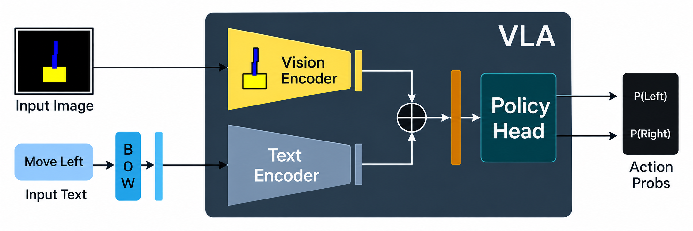

# Vision-Language-Action (VLA) Pipeline Overview

This document provides a detailed architecture breakdown, current behavior observations, and recommended enhancements for the minimal **Vision-Language-Action (VLA)** pipeline built with PyTorch and Gymnasium.

---

## Architecture & Component Breakdown

### 1. Custom Environment (`MiniCartPoleVisionEnv`)
* **Visual Observations**: Replaces traditional vector state inputs with $64 \times 64 \times 3$ RGB pixel images (rendering a yellow cart and blue pole on a black background).
* **Action Space**: Defines two discrete actions:
  * `0`: Move left by $-0.05$
  * `1`: Move right by $+0.05$
* **Dynamics**: Pole angle updates incorporate stochastic Gaussian noise ($\Delta\theta \sim \mathcal{N}(0, 0.02^2)$).

### 2. Vision Encoder
* Consists of a 2-layer 2D Convolutional network with ReLU activations and stride 2.
* Reduces image spatial dimensions from $64 \times 64 \times 3 \rightarrow 32 \times 32 \times 16 \rightarrow 16 \times 16 \times 32$.
* Flattens into an $8,192$-dimensional visual representation vector.

### 3. Language Encoder
* Utilizes a lightweight Bag-of-Words (BoW) hash vector mapped through a linear embedding layer (`nn.Linear(vocab_size=1000, embed_dim=32)`).
* Converts string instructions (e.g., `"keep the pole upright"`) into a dense 32-dimensional language vector.

### 4. Multimodal Fusion & Policy Head
* Concatenates visual ($8,192$) and text ($32$) feature embeddings into an $8,224$-dimensional multimodal vector.
* Passes fused features through a hidden linear layer ($8224 \rightarrow 64$), ReLU non-linearity, and an action projection layer ($64 \rightarrow 2$) with Softmax activation to generate categorical action probabilities.

---

## Current Behavior & Key Observations

1. **Pipeline Integrity**: The forward pass correctly handles tensor transformations, channel reordering (`permute(0, 3, 1, 2)`), image normalization (`/ 255.0`), and feature concatenation.
2. **Untrained Policy**: Because network parameters are randomly initialized without policy optimization, the network outputs arbitrary action probabilities (leading to fixed bias toward specific actions).

---
