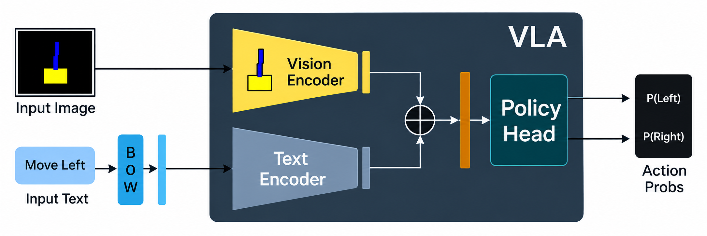

# VLA from Scratch — Building the Starting Point

This document walks through the architecture and decisions I made in [`vla-scratch.ipynb`](../vla-scratch.ipynb) — the simplest possible end-to-end VLA pipeline, built entirely from scratch with no training loop and no pretrained weights.

All information here comes directly from that notebook.

---

## Why I Built This First

I wanted to verify the complete **vision → language → fusion → action** pipeline works before adding any learning. The `vla-scratch.ipynb` notebook does exactly that: it proves every tensor flows correctly through the full loop, using only randomly initialized weights.

---

## Architecture & Component Breakdown

### 1. Custom Environment (`MiniCartPoleVisionEnv`)

I built a minimal Gymnasium environment that gives the agent a 64×64 RGB image instead of a raw state vector.

**Visual Observations:** The environment renders a yellow cart and a blue pole on a black background. It outputs `64 × 64 × 3` RGB pixel images via Pillow.

**Observation and action spaces:**

```text
observation_space = Box(0, 255, shape=(64, 64, 3), dtype=uint8)
action_space      = Discrete(2)
```

I confirmed this by running:

```text
The observation space has shape: (64, 64, 3)
The action space has 2 values
```

**Action Space:**
- `0`: Move cart left (`x ← x - 0.05`)
- `1`: Move cart right (`x ← x + 0.05`)

**Dynamics:** In this starting-point notebook I used simple dynamics — the pole angle updates with stochastic Gaussian noise (`Δθ ~ N(0, 0.02²)`) independent of the action. The action only moves the cart. Reward is `-|theta|` and the episode terminates when `|theta| > 0.5`.

**The initial rendered observation:**


I rendered the observation immediately after `env.reset()` to visually confirm the cart and pole appear correctly before touching any neural network code.

I then manually stepped both actions to verify the environment changes:

```python
obs, reward, terminated, truncated, _ = env.step(0)  # move left
obs, reward, terminated, truncated, _ = env.step(1)  # move right
```

---

### 2. Vision Encoder

I built a 2-layer 2D convolutional network with ReLU activations and stride 2.

```python
self.vision = nn.Sequential(
    nn.Conv2d(3, 16, 3, stride=2, padding=1),
    nn.ReLU(),
    nn.Conv2d(16, 32, 3, stride=2, padding=1),
    nn.ReLU(),
    nn.Flatten(),
)
self.vision_out = 32 * 16 * 16  # = 8192
```

Spatial dimensions change as follows:

```text
64 × 64 × 3
       ↓ Conv2d(3→16, stride=2)
32 × 32 × 16
       ↓ Conv2d(16→32, stride=2)
16 × 16 × 32
       ↓ Flatten
8192-dimensional visual representation vector
```

The image is first normalized (`/ 255.0`) and transposed from NHWC to NCHW:

```python
v = image / 255.0
v = v.permute(0, 3, 1, 2)
v = self.vision(v)
```

---

### 3. Language Encoder

I used a lightweight Bag-of-Words (BoW) hash vector mapped through a linear embedding layer.

```python
def make_bow_instruction(text, vocab_size=1000):
    bow = torch.zeros(vocab_size)
    for w in text.lower().split():
        idx = abs(hash(w)) % vocab_size
        bow[idx] += 1
    return bow
```

Each word is hashed into one of 1,000 buckets. Different words can collide into the same bucket. For this starting-point notebook, that is acceptable — the purpose is to demonstrate the pipeline works end-to-end, not to build a high-quality language representation.

The resulting 1,000-D vector is projected into a 32-D embedding:

```python
self.text_embed = nn.Linear(vocab_size, embed_dim)  # Linear(1000, 32)
```

I used the instruction `"keep the pole upright"` throughout.

---

### 4. Multimodal Fusion & Policy Head

I concatenated the visual (8,192-D) and text (32-D) feature embeddings into an 8,224-D multimodal vector, then passed it through a small MLP:

```text
8192 (vision) + 32 (language) = 8224 (fused)
       ↓
Linear(8224, 64)
       ↓
ReLU
       ↓
Linear(64, 2)
       ↓
2 action logits → Softmax → P(left), P(right)
```

The selected action: `action = argmax(probabilities)`

```python
self.policy = nn.Sequential(
    nn.Linear(self.vision_out + embed_dim, 64),
    nn.ReLU(),
    nn.Linear(64, 2)
)
```

The forward pass:

```python
def forward(self, image, bow_text):
    v = image / 255.0
    v = v.permute(0, 3, 1, 2)
    v = self.vision(v)
    t = self.text_embed(bow_text)
    z = torch.cat([v, t], dim=-1)
    logits = self.policy(z)
    return torch.softmax(logits, dim=-1)
```

---

## Architecture Diagram



---

## The Inference Loop

I ran a 5-step inference loop to demonstrate the full control loop working:

```python
env = MiniCartPoleVisionEnv()
obs, _ = env.reset()

model = MiniVLA()
model.eval()

instruction = "keep the pole upright"
bow = make_bow_instruction(instruction).unsqueeze(0)

for step in range(5):
    img = torch.tensor(obs).float().unsqueeze(0)
    with torch.no_grad():
        action_prob = model(img, bow)
        action = torch.argmax(action_prob, dim=-1).item()
    obs, reward, done, truncated, info = env.step(action)
    print(f"step={step}, action={action}, reward={reward:.3f}")
    if done:
        print("Episode ended.")
        break
```

**Output:**

```text
step=0, action=1, reward=-0.099
step=1, action=1, reward=-0.070
step=2, action=1, reward=-0.091
step=3, action=1, reward=-0.091
step=4, action=1, reward=-0.104
```

The network outputs arbitrary probabilities because the weights are randomly initialized and there is no training. The useful thing here is that the entire loop runs without errors — the tensor shapes are correct at every stage.

---

## Decision Visualization

I visualized the model's decision at each step — left panel shows the current RGB observation, right panel shows the action probabilities:

```python
plt.subplot(1, 2, 1)
plt.imshow(obs)
plt.title("Observation(rgb)")

plt.subplot(1, 2, 2)
plt.bar(["Left(0)", "Right(1)"], probs)
plt.title(f"Action probabilities\nAction taken:{action}")
```

**Observation + action probability bar chart (untrained network):**


The probabilities are near 50/50 — exactly what I expect from a randomly initialized network.

---

## Pipeline Integrity & Key Observations

1. **Pipeline Integrity:** The forward pass correctly handles tensor transformations — `permute(0, 3, 1, 2)` for channel reordering, `/ 255.0` for image normalization, and `torch.cat` for feature concatenation.

2. **Untrained Policy:** Because network parameters are randomly initialized without policy optimization, the network outputs arbitrary action probabilities, leading to a near-uniform or slightly biased distribution depending on weight initialization.

3. **No training required:** The entire notebook can run without any dataset, pretrained model, or training loop — just `pip install gymnasium pillow torch`.

---

## Trainable Parameters

I calculated the parameter count manually:

| Component | Parameters |
|---|---:|
| Conv1: `3×16×3×3 + 16` | 448 |
| Conv2: `16×32×3×3 + 32` | 4,640 |
| Language Linear: `1000×32 + 32` | 32,032 |
| Policy FC1: `8224×64 + 64` | 526,400 |
| Policy FC2: `64×2 + 2` | 130 |
| **Total** | **563,650** |

The majority of parameters are in the first policy layer because the flattened image vector is 8,192 dimensions.

---

## What This Starting Point Proves

By the end of `vla-scratch.ipynb`, I had confirmed:

- The environment renders a 64×64 RGB image correctly
- Both actions visibly change the environment state
- The CNN vision encoder produces an 8,192-D feature vector
- The BoW language encoder produces a 1,000-D vector, projected to 32-D
- The fused 8,224-D vector flows through the policy head without shape errors
- The full inference loop runs end-to-end, printing step, action, and reward at each step
- The visualization shows observation and action probabilities side by side

This confirmed the architecture is correct before moving to the training stage in `vla-practical-demo.ipynb`.
